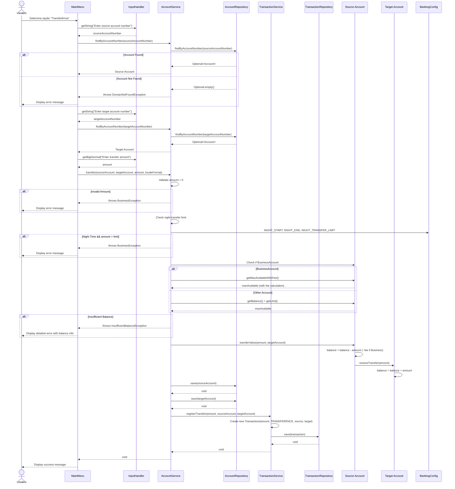

# Sistema Bancário - Challenge 1

Simulação de aplicação bancária desenvolvida em Java que permite gerenciar contas, realizar transações e exportar histórico em formato CSV.

Para mais detalhes sobre as decisões técnicas e arquiteturais do projeto, consulte o arquivo [Decisoes_Tecnicas_e_Arquiteturais.md](docs/Decisoes_Tecnicas_e_Arquiteturais.md).

Os diagramas de classes e sequência estão disponíveis ao final deste documento.

Como Executar:

Clone ou baixe este repositório para o seu computador.
Em seguida, abra o terminal (CMD, PowerShell ou outro) e navegue até o diretório raiz do projeto.

Execute o programa principal com o comando:

```bash
java -cp bin application.Program
```

**Como Usar:**

**1 - Inicialização**

Ao iniciar o programa, você será perguntado:

"Do you want to pre-populate the system with sample data?"

- Responda `y` para carregar dados de exemplo (clientes Alice e Bob com contas pré-criadas)
- Responda `n` para iniciar com o sistema vazio

**2 - Em seguida, selecione o formato de exibição de valores monetários**

1. BR (R$ 1.234,56)
2. US ($1,234.56)

**3 - Menu Inicial**

Após a configuração inicial, você verá duas opções:

1. Register new client
2. Login with existing client

Registrando um Novo Cliente:

Selecione a opção 1 e forneça:
- Nome do cliente
- Senha (será solicitada no login)

Após o registro, você será automaticamente logado no sistema.

Fazendo Login:

Selecione a opção 2:
1. Será exibida uma lista numerada de todos os clientes cadastrados
2. Digite o número correspondente ao cliente desejado
3. Digite a senha (você tem 3 tentativas)

**4 - Menu Principal**

Após o login, você terá acesso às seguintes operações:

1. Deposit - Realizar depósito em qualquer conta do sistema
2. Withdraw - Realizar saque de uma conta própria
3. Transfer - Transferir valores entre contas
4. Update limit of an account - Alterar o limite de crédito de uma conta própria
5. View my accounts - Visualizar todas as suas contas
6. Create new account - Criar uma nova conta (corrente, poupança ou empresarial)
7. Export transactions (CSV) - Exportar histórico de transações de uma ou de todas suas contas
8. Logout - Retornar ao menu inicial
0. Exit - Encerrar o programa

**5 - Realizando Operações**

Depósito:
- Informe o número da conta (pode ser qualquer conta do sistema)
- Informe o valor a depositar

Saque:
- Informe o número da conta (deve ser uma conta sua)
- Informe o valor a sacar
- O sistema valida se há saldo + limite disponível

Transferência:
- Informe o número da conta de origem (deve ser uma conta sua)
- Informe o número da conta de destino
- Informe o valor a transferir
- O sistema exibe um recibo com os detalhes da operação

Alterar Limite:
- Informe o número da conta (deve ser uma conta sua)
- Informe o novo valor do limite

Criar Nova Conta:
- Informe o número da agência (pode ser nova ou existente)
- Informe o número da conta (deve ser único)
- Selecione o tipo:
  1. Business Account
  2. Checking Account
  3. Savings Account
- Informe o saldo inicial

Exportar Transações:
- Escolha se serão exportadas as transações de todas suas contas ou de apenas uma
- Escolha o delimitador CSV (vírgula ou ponto e vírgula)
- Informe o caminho completo para salvar o arquivo, incluindo o nome do arquivo (é necessário criar uma pasta e escolher um local que o programa possua permissão)

**Regras Importantes:**

Tipos de Conta:
- Conta Corrente: Limite inicial de R$ 1.000,00
- Conta Poupança: Limite inicial zero, rendimento de 0,5% ao aplicar juros
- Conta Empresarial: Limite inicial de R$ 50.000,00, taxa de 0,75% em todas as transações

Restrições:
- Transferências noturnas (entre 20h e 6h) são limitadas a R$ 1.000,00
- Só é possível sacar e transferir de contas próprias
- Depósitos podem ser feitos em qualquer conta do sistema
- O valor disponível para saque/transferência é: saldo + limite (considerando taxa se for conta empresarial)

**Dados de Exemplo**

Se você escolher pré-popular o sistema, os seguintes dados serão carregados:

Clientes:
- Alice (senha: 123)
- Bob (senha: 123)

Contas:
- Conta 0001 (Alice) - Agência 001 - Conta Corrente - Saldo inicial: R$ 1.000,00
- Conta 0002 (Bob) - Agência 002 - Conta Empresarial - Saldo inicial: R$ 5.000,00

Transações pré-carregadas:
- Depósito de R$ 500,00 na conta de Alice
- Saque de R$ 200,00 da conta de Alice
- Transferência de R$ 150,00 de Alice para Bob

**Diagrama de sequência**

O diagrama de sequência ilustra o fluxo completo de uma operação de transferência bancária, demonstrando a interação entre as camadas da aplicação (UI, Services, Repositories e Domain). A operação inclui validações de saldo, verificação de limite noturno, cálculo de taxas para contas empresariais e persistência de dados.



**Diagrama de classes**

O diagrama de classes apresenta a estrutura completa do sistema bancário, organizado em camadas:

Domain: Entidades de negócio (Client, Account, Transaction, Agency) com hierarquia de herança para tipos de conta (CheckingAccount, SavingsAccount, BusinessAccount)
Services: Camada de lógica de negócio que orquestra operações entre repositórios e entidades
Repositories: Interfaces para acesso a dados com implementações InMemory
DTOs: Objetos de transferência de dados para desacoplamento entre camadas
Exceptions: Hierarquia customizada de exceções (DomainException → BusinessException/ValidationException)
Enums: TransactionType, LocaleFormat e CsvDelimiter para valores fixos
Utils: Classes auxiliares (BankingConfig, NumberFormatter, CsvExporter, InputHandler)

O diagrama demonstra os relacionamentos de herança, associações entre classes e dependências entre camadas, seguindo os princípios de baixo acoplamento e alta coesão:

```mermaid
classDiagram
    %% Domain Layer - Entities
    class BaseIdEntity {
        <<abstract>>
        #UUID id
        +getId() UUID
    }

    class Client {
        -String name
        -String password
        -List~Account~ accounts
        +Client(String name, String password)
        +getName() String
        +getPassword() String
        +getAccounts() List~Account~
        +addAccount(Account account) void
        +validatePassword(String input) boolean
        +hashCode() int
        +equals(Object obj) boolean
        +toString() String
    }

    class Agency {
        -String agencyNumber
        -List~Account~ accounts
        +Agency(String agencyNumber)
        +getAgencyNumber() String
        +getAccounts() List~Account~
        +addAccount(Account account) void
        +hashCode() int
        +equals(Object obj) boolean
        +toString() String
    }

    class Account {
        <<abstract>>
        -String accountNumber
        -Client client
        -Agency agency
        #BigDecimal balance
        #BigDecimal limit
        -List~Transaction~ transactions
        +Account(String accountNumber, Client client, Agency agency, BigDecimal balance, BigDecimal limit)
        +getClient() Client
        +getAccountNumber() String
        +getAgency() Agency
        +getBalance() BigDecimal
        +setBalance(BigDecimal balance) void
        +getLimit() BigDecimal
        +setLimit(BigDecimal limit) void
        +getTransactions() List~Transaction~
        +addTransaction(Transaction transaction) void
        +withdrawValue(BigDecimal amount) void
        +depositValue(BigDecimal amount) void
        +receiveTransfer(BigDecimal amount) void
        +transferValue(BigDecimal amount, Account targetAccount) void
        +getAccountType()* String
        +hashCode() int
        +equals(Object obj) boolean
        +toString() String
    }

    class CheckingAccount {
        +CheckingAccount(String accountNumber, Client client, Agency agency, BigDecimal balance)
        +getAccountType() String
    }

    class SavingsAccount {
        +SavingsAccount(String accountNumber, Client client, Agency agency, BigDecimal balance)
        +applyInterest() void
        +getAccountType() String
    }

    class BusinessAccount {
        +BusinessAccount(String accountNumber, Client client, Agency agency, BigDecimal balance)
        +withdrawValue(BigDecimal amount) void
        +depositValue(BigDecimal amount) void
        +transferValue(BigDecimal amount, Account targetAccount) void
        -calculateFee(BigDecimal amount) BigDecimal
        +getMaxAvailableWithFee() BigDecimal
        +getAccountType() String
    }

    class Transaction {
        -LocalDateTime transactionTime
        -BigDecimal amount
        -TransactionType type
        -Account sourceAccount
        -Account targetAccount
        +Transaction(BigDecimal amount, TransactionType type, Account sourceAccount, Account targetAccount)
        +Transaction(BigDecimal amount, TransactionType type, Account account)
        +getTransactionTime() LocalDateTime
        +getAmount() BigDecimal
        +getType() TransactionType
        +getSourceAccount() Account
        +getTargetAccount() Account
        +hashCode() int
        +equals(Object obj) boolean
        +toString() String
    }

    %% Enums
    class TransactionType {
        <<enumeration>>
        WITHDRAW
        DEPOSIT
        TRANSFERENCE
        -int code
        +getCode() int
        +valueOf(int code)$ TransactionType
    }

    class LocaleFormat {
        <<enumeration>>
        BR
        US
        -int code
        +getCode() int
        +valueOf(int code)$ LocaleFormat
    }

    class CsvDelimiter {
        <<enumeration>>
        COMMA
        SEMICOLON
        -int code
        -char delimiter
        +getCode() int
        +getDelimiter() char
        +valueOf(int code)$ CsvDelimiter
    }

    %% Service Layer
    class AccountService {
        -AccountRepository accountRepository
        -TransactionService transactionService
        -ClientService clientService
        -AgencyService agencyService
        +AccountService(AccountRepository, TransactionService, ClientService, AgencyService)
        +save(Account account) void
        +findByAccountNumber(String number) Account
        +findAll() List~Account~
        +transfer(Account source, Account target, BigDecimal amount, LocaleFormat localeFormat) void
        +deposit(Account targetAccount, BigDecimal amount) void
        +withdraw(Account sourceAccount, BigDecimal amount, LocaleFormat localeFormat) void
        +updateLimit(Account account, BigDecimal newLimit) void
        +createBusinessAccount(String accountNumber, Client loggedClient, Agency agency, BigDecimal initialBalance) AccountDTO
        +createCheckingAccount(String accountNumber, Client loggedClient, Agency agency, BigDecimal initialBalance) AccountDTO
        +createSavingsAccount(String accountNumber, Client loggedClient, Agency agency, BigDecimal initialBalance) AccountDTO
    }

    class ClientService {
        -ClientRepository clientRepository
        +ClientService(ClientRepository clientRepository)
        +save(Client client) void
        +findAll() List~Client~
        +findById(UUID id) Client
        +deleteById(UUID id) void
    }

    class AgencyService {
        -AgencyRepository agencyRepository
        +AgencyService(AgencyRepository agencyRepository)
        +save(Agency agency) void
        +findAll() List~Agency~
        +findByNumber(String agencyNumber) Agency
        +deleteByNumber(String agencyNumber) void
        +findOrCreate(String agencyNumber) Agency
    }

    class TransactionService {
        -TransactionRepository transactionRepository
        +TransactionService(TransactionRepository transactionRepository)
        +deposit(BigDecimal amount, Account account) void
        +withdraw(BigDecimal amount, Account account) void
        +registerTransfer(BigDecimal amount, Account source, Account target) void
        +findAll() List~Transaction~
        +findByAccount(Account account) List~Transaction~
        +findById(UUID id) Transaction
        +deleteById(UUID id) void
    }

    %% Repository Layer
    class AccountRepository {
        <<interface>>
        +save(Account account) void
        +findAll() List~Account~
        +findByAccountNumber(String accountNumber) Optional~Account~
    }

    class ClientRepository {
        <<interface>>
        +save(Client client) void
        +findAll() List~Client~
        +findById(UUID uuid) Optional~Client~
        +deleteById(UUID uuid) void
    }

    class AgencyRepository {
        <<interface>>
        +save(Agency agency) void
        +findAll() List~Agency~
        +findByAgencyNumber(String agencyNumber) Optional~Agency~
        +deleteByAgencyNumber(String agencyNumber) void
    }

    class TransactionRepository {
        <<interface>>
        +save(Transaction transaction) void
        +findAll() List~Transaction~
        +findById(UUID uuid) Optional~Transaction~
        +deleteById(UUID uuid) void
    }

    %% DTOs
    class AccountDTO {
        -String accountNumber
        -ClientDTO clientDTO
        -AgencyDTO agencyDTO
        +AccountDTO(Account account)
        +getAccountNumber() String
        +getClientDTO() ClientDTO
        +getAgencyDTO() AgencyDTO
        +hashCode() int
        +equals(Object obj) boolean
        +toString() String
    }

    class ClientDTO {
        -String id
        -String name
        +ClientDTO(Client client)
        +getId() String
        +getName() String
        +hashCode() int
        +equals(Object obj) boolean
        +toString() String
    }

    class AgencyDTO {
        -String agencyNumber
        +AgencyDTO(Agency agency)
        +getAgencyNumber() String
        +hashCode() int
        +equals(Object obj) boolean
        +toString() String
    }

    class TransactionDTO {
        -String id
        -TransactionType type
        -BigDecimal amount
        -LocalDateTime transactionTime
        -AccountDTO sourceAccount
        -AccountDTO targetAccount
        +TransactionDTO(Transaction transaction)
        +getId() String
        +getType() TransactionType
        +getAmount() BigDecimal
        +getTransactionTime() LocalDateTime
        +getSourceAccount() AccountDTO
        +getTargetAccount() AccountDTO
        +hashCode() int
        +equals(Object obj) boolean
        +toString() String
    }

    %% Exception Hierarchy
    class DomainException {
        <<abstract>>
        +DomainException(String message)
    }

    class BusinessException {
        +BusinessException(String message)
    }

    class ValidationException {
        +ValidationException(String message)
    }

    class InsufficientBalanceException {
        +InsufficientBalanceException(String message)
    }

    class DomainNotFoundException {
        +DomainNotFoundException(String message)
    }

    class InvalidInputException {
        +InvalidInputException(String message)
    }

    %% Utility Classes
    class BankingConfig {
        <<utility>>
        +NIGHT_TRANSFER_LIMIT$ BigDecimal
        +NIGHT_START$ LocalTime
        +NIGHT_END$ LocalTime
        +DEFAULT_BUSINESS_ACCOUNT_LIMIT$ BigDecimal
        +BUSINESS_ACCOUNT_PERCENTUAL_FEE$ BigDecimal
        +DEFAULT_CHECKING_ACCOUNT_LIMIT$ BigDecimal
        +DEFAULT_SAVINGS_ACCOUNT_LIMIT$ BigDecimal
        +SAVINGS_ACCOUNT_INTEREST_RATE$ BigDecimal
    }

    class NumberFormatter {
        <<utility>>
        +formatAmount(BigDecimal amount, LocaleFormat localeFormat)$ String
        +formatTime(LocalTime time)$ String
    }

    class CsvExporter {
        <<utility>>
        +exportTransactionsToCsv(List~Transaction~ transactions, File file, LocaleFormat localeFormat, CsvDelimiter delimiter)$ void
    }

    class InputHandler {
        -Scanner scanner
        +getString(String message) String
        +getBigDecimal(String message) BigDecimal
        +getInt(String message) int
        +getConfirmation(String message) boolean
        +waitForEnter() void
    }

    %% Relationships - Inheritance
    BaseIdEntity <|-- Client
    BaseIdEntity <|-- Transaction
    Account <|-- CheckingAccount
    Account <|-- SavingsAccount
    Account <|-- BusinessAccount
    RuntimeException <|-- DomainException
    DomainException <|-- BusinessException
    DomainException <|-- ValidationException
    BusinessException <|-- InsufficientBalanceException
    ValidationException <|-- DomainNotFoundException
    ValidationException <|-- InvalidInputException

    %% Relationships - Associations
    Client "1" --> "0..*" Account : owns
    Agency "1" --> "0..*" Account : contains
    Account "1" --> "1" Client : belongsTo
    Account "1" --> "1" Agency : locatedAt
    Account "1" --> "0..*" Transaction : has
    Transaction "0..*" --> "0..1" Account : sourceAccount
    Transaction "0..*" --> "0..1" Account : targetAccount
    Transaction --> TransactionType : uses

    %% Service Dependencies
    AccountService --> AccountRepository : uses
    AccountService --> TransactionService : uses
    AccountService --> ClientService : uses
    AccountService --> AgencyService : uses
    ClientService --> ClientRepository : uses
    AgencyService --> AgencyRepository : uses
    TransactionService --> TransactionRepository : uses

    %% DTO Dependencies
    AccountDTO --> ClientDTO : contains
    AccountDTO --> AgencyDTO : contains
    TransactionDTO --> AccountDTO : contains
    TransactionDTO --> TransactionType : uses
```

